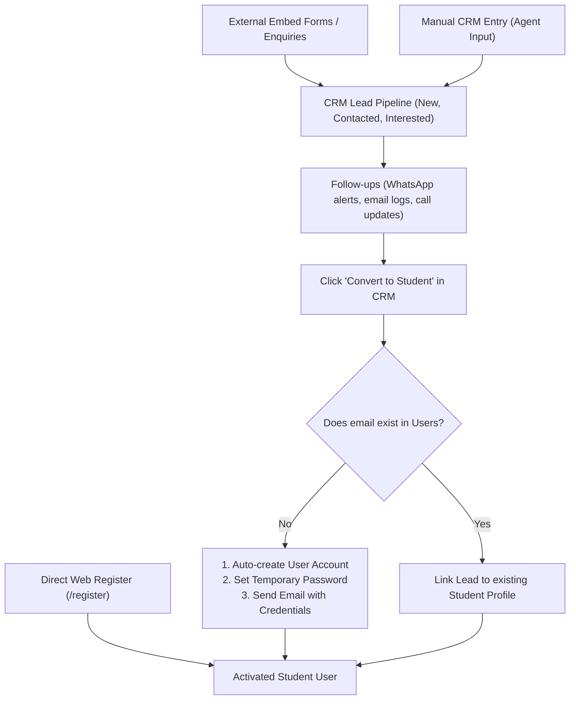
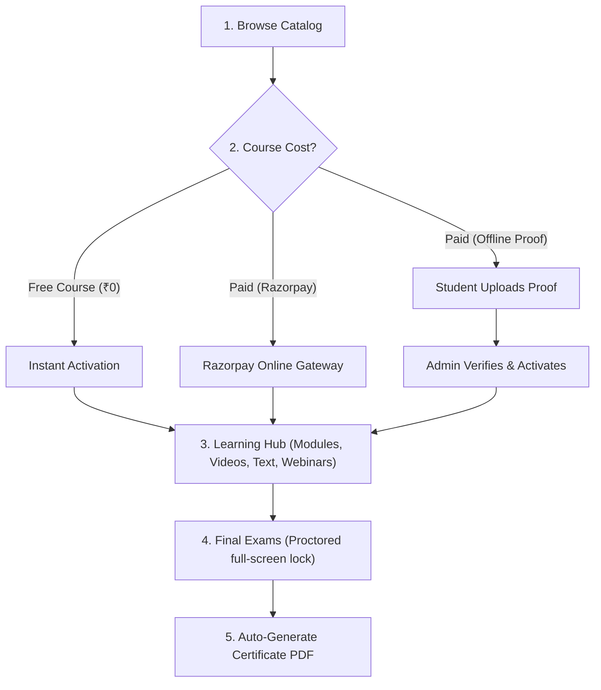
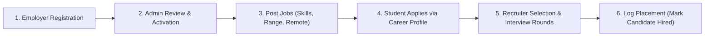

# AEMS: Academy & Employment Management System
## End-to-End Application Workflow & Functional Documentation

Welcome to the comprehensive system documentation for the **Academy & Employment Management System (AEMS)**. This guide details the complete application flow, module by module, written in a narrative style matching the chronological user lifecycle from ingestion to placement and system administration.

---

## 1. System Architecture & User Roles

AEMS is a unified platform connecting students, educators, employers, and administrators. The system supports six distinct user roles:

| Role | Description |
|---|---|
| **Student** | Learns via courses, takes exams, generates certificates, and applies for jobs. |
| **Tutor / Instructor** | Authors course curricula, manages learning assets, and answers student questions. |
| **Employer / Company** | Publishes job openings, reviews applicants, and schedules interviews. |
| **CRM Agent** | Manages prospective leads, follow-ups, and customer acquisition. |
| **Sub-Admin** | Handles moderate operations, user verifications, and general approvals. |
| **Super Admin** | Configures system integrations, gateway credentials, brand assets, and system settings. |

---

## 2. Lead Ingestion & Student Onboarding (The Entry Point)

The user lifecycle begins when a prospect is captured in the database, either as a CRM lead or directly via public registration.

### Stage A: Inbound CRM Leads
Prospective candidates who express interest through marketing channels are tracked in the CRM:
* **Embedded Enquiry Widgets**: Admins build custom enquiry forms in the **Form Builder** (collecting fields like Name, Email, Phone, and Course Interests). The system generates iframe embed codes so these forms can be inserted on external marketing pages or landing sites. Form submissions automatically create records in the `leads` table.
* **Manual Additions**: CRM agents directly input leads from telephone calls, events, or walk-ins.
* **Nurturing Pipeline**: Leads are qualified through stages: `New` ➔ `Contacted` ➔ `Interested`. Call logs, WhatsApp template updates, and email follow-ups are recorded chronologically in the lead's timeline.

### Stage B: Automated Lead Conversion
When a CRM lead is ready to enroll, the agent clicks **"Convert to Student"** in the CRM:
* **Duplicate Prevention**: The backend checks if a user account with that email already exists. If the student previously registered directly, the converter simply links the CRM history to their existing student profile.
* **Automatic Account Creation**: If the email is new, the backend:
  1. Inserts a new record in `users` with the role `"student"`.
  2. Generates a secure, temporary password.
  3. Installs a blank profile in `student_profiles`.
  4. Emails the student their login credentials and temporary password.
* **Security Enforcement**: Upon their first login, the student is forced to set a custom password before accessing the system.

### Stage C: Direct Student Registration
Students can bypass the CRM by navigating directly to the portal's `/register` page:
* **Dynamic Forms**: They fill in their Name, Email, Phone, Gender (restricted to Male/Female), DOB, and Education Level. The education level dropdown options are populated dynamically from settings in the Admin Panel.
* **Instant Activation**: Upon submission, the student's user account is instantly active and ready to log in.

---

## 3. The Student's Academic & Learning Journey (LMS)

Once onboarding is complete, the student transitions to the Learning Management System (LMS) to acquire skills.

### Stage A: Enrolling in Courses
* **Free Enrollment**: Enrolling in free courses (₹0) automatically registers the student and generates a ₹0 invoice marked as `"paid"`.
* **Online Payment (Razorpay)**: Checking out via online payment opens the Razorpay gateway. Successful transaction callbacks activate the course instantly.
* **Offline Payment Proof**:
  - The student inputs transaction info and uploads a copy of the payment receipt.
  - The enrollment is set to `"suspended_offline"`, and the student sees a success card preventing double-clicks.
  - Operations staff verify the receipt in the Admin Panel, mark the invoice as `"paid"`, which activates the course and compiles a downloadable PDF receipt.

### Stage B: The Course Player & Learning Hub
* **Modules & Lessons**: Active courses display sections and modules containing video instructions (YouTube/Vimeo integrations), rich-text files, attachments, and resource URLs.
* **Mandatory progression**: Students must complete mandatory lessons in order to unlock subsequent modules.
* **Q&A Forums**: Students post questions directly under lessons to get help from instructors.
* **Live Webinars**: Students register and join live webcasts (Zoom/Google Meet links) scheduled by tutors.

### Stage C: Proctoring & Automated Certifications
* **Exam Portal**: The student takes final exams. If proctoring is enabled, it locks the screen and logs camera/tab-switching warnings. Exceeding warnings terminates the exam.
* **Certificates**: Passing the exam dynamically compiles a branded PDF certificate with the student's name, institution logo, signatures, and a verify URL/QR code.

---

## 4. Job Board & Employment Placements

After graduating from courses, students connect with hiring organizations in the Job Placement module.

### Stage A: Build Career Profiles
* Under settings, students synchronize their **Education** (Degrees, schools) and **Work Experience** (past companies, durations) matching what admins see in the backend.

### Stage B: Employer Onboarding
* Hiring organizations apply by providing company details, size, and website URL.
* Admins review and activate company profiles to ensure valid job listings.

### Stage C: Job Search & Recruitment
* **Posting Jobs**: Approved employers post job listings with categories, required skills, work modes (Remote/Hybrid/On-site), and salary ranges.
* **Application**: Students apply with their profiles.
* **Interview Workflow**: Recruiters move candidate applications through custom pipelines (Applied, Shortlisted, Interviewing, Hired/Rejected) and schedule interview rounds. Marking them as `"hired"` updates the placement logs.

---

## 5. Course Management & Tutor Dashboard

Tutors build and manage the educational content powering the LMS.

* **Apply to Teach**: Tutors register with specialization fields and experience history, which are manually reviewed by admins before dashboard activation.
* **Course Authoring**: Tutors write courses, drag-and-drop modules, and upload videos and texts.
* **Interaction**: Tutors schedule webinars, review submitted assignments, and answer lesson Q&As.

---

## 6. System Administration & Global Settings

Super Admins configure and maintain the central technical settings of AEMS.

* **Branding Settings**: Customize logo, favicon, brand primary/secondary colors, and hero/about images on the landing page.
* **LMS settings**: Manage dynamic options for **Course Languages** and **Student Education Levels** used in registration.
* **Gateway Integrations**: Setup API credentials for Razorpay (payments), SMTP (automatic emails), and WhatsApp Cloud API (alerts).
* **Terms & Versioning**: Control terms of service and privacy configurations.

---

> [!IMPORTANT]
> **Daily Database Backups**
> The system runs an automated background script daily at 2:00 AM server time to dump the database and physically delete backups older than 7 days from the server to optimize storage.
