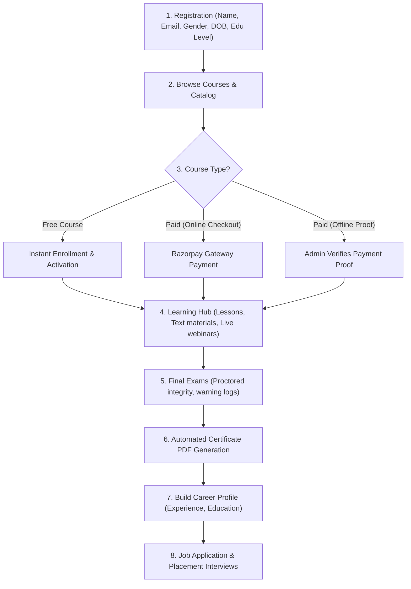
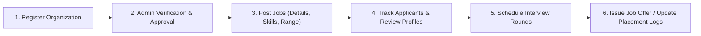
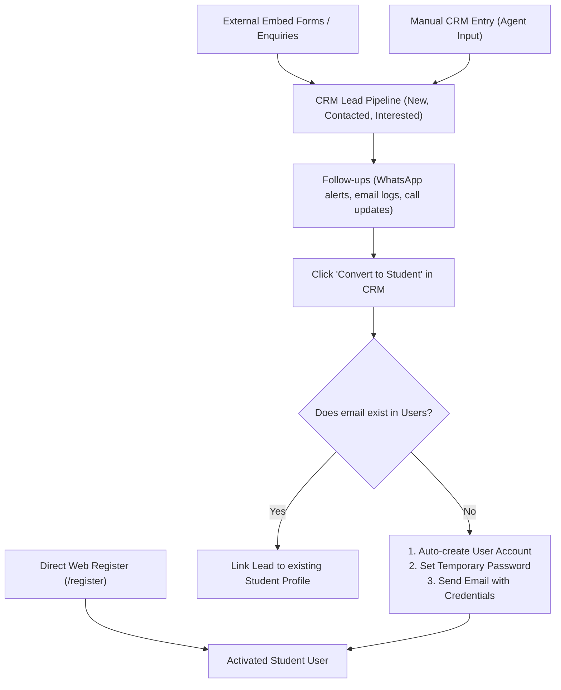

# AEMS: Academy & Employment Management System
## End-to-End Application Workflow & Functional Documentation

Welcome to the comprehensive system documentation for the **Academy & Employment Management System (AEMS)**. This guide details the complete application flow, module by module, written in a narrative style mapping user journeys from registration to placement and system administration.

---

## 1. System Architecture & User Roles

AEMS is a unified platform connecting students, educators, employers, and administrators. The system supports six distinct user roles:

| Role | Description |
|---|---|
| **Student** | Learns via courses, takes exams, generates certificates, and applies for jobs. |
| **Tutor / Instructor** | Authors course curricula, manages learning assets, and answers student questions. |
| **Employer / Company** | Publishes job openings, reviews applicants, and schedules interviews. |
| **CRM Agent** | Manages prospective leads, follow-ups, and customer acquisition. |
| **Sub-Admin** | Handles moderate operations, user verifications, and general approvals. |
| **Super Admin** | Configures system integrations, gateway credentials, brand assets, and system settings. |

---

## 2. The Student's Journey: From Guest to Placed Professional

### Stage A: Registration & Onboarding
1. **Sign-up**: The student navigates to the Registration page. They fill in their **Full Name**, **Phone Number**, **Email**, **Password**, **Gender** (restricted to Male/Female), **Date of Birth**, and **Education Level**.
2. **Dynamic Options**: The list of available "Education Level" options is pulled dynamically from the database, allowing admins to adjust what qualifications are listed.
3. **Onboarding**: Upon clicking register, their `user` record is activated instantly, and a blank profile is created in `student_profiles`.

### Stage B: Course Enrollment & Checkouts
Students browse the courses catalog using category filters and search tools. To start learning, they enroll via three workflows:
* **Free Courses (₹0)**: Enrolling triggers an instant enrollment with status `"active"` and generates a ₹0 invoice marked as `"paid"`.
* **Online Payment (Razorpay)**: The checkout opens a secure Razorpay modal. Upon successful card/UPI authorization, a webhook notifies AEMS, activating the course immediately.
* **Offline Payment Proof**:
  - The student inputs details (transaction ID, date, bank name) and uploads a payment receipt image.
  - The enrollment status is set to `"suspended_offline"` until approved.
  - Double-clicks are protected by a thank-you success overlay that prevents resubmissions.

### Stage C: Learning Hub & Progression
Once enrolled, the student gains access to the Course Player:
* **Modules & Lessons**: Curriculums are organized into sections and modules containing video lessons (YouTube/Vimeo hosting), rich-text guides, and attachments.
* **Mandatory Lessons**: If marked as mandatory by the instructor, the student must complete them in sequence before proceeding.
* **Live Webinars**: Students can register and join live Google Meet/Zoom events scheduled directly within the dashboard.

### Stage D: Exams & Certifications
* **Exam Portal**: When ready, the student attempts the course's final exam.
* **Proctoring Integrity**: If enabled, the exam enforces full-screen locks and camera monitoring. Tab switches trigger warnings. Exceeding warnings terminates the exam and logs a failure.
* **Certificates**: Passing the exam triggers the background generation of a branded PDF certificate with the student's name, institution logo, signatures, and a unique verify URL/QR code.

### Stage E: Job Search & Application
* **Career Profiler**: Under settings, the student synchronizes their profile by adding **Work Experience** and **Academic Degrees** (Education).
* **Job Board**: Students browse job vacancies posted by verified employers.
* **Instant Apply**: Students apply using their profile data. They can track the status of their application (Applied, Shortlisted, Interviewing, Hired/Rejected) from their student portal.

---

## 3. The Tutor's Journey: Authoring & Mentoring

### Stage A: Applying to Teach
1. **Application**: Tutors register by providing their qualifications, LinkedIn URL, specialization, and teaching experience.
2. **Review**: The tutor profile is placed in a `"pending"` state. Admins are notified of the application.
3. **Activation**: Once verified and approved by an admin, the tutor receives an email notification and can log into the Tutor Dashboard.

### Stage B: Curriculum Authoring
* **Course Creation**: Tutors create new courses by adding titles, descriptions, categories, languages, and featured images.
* **Course Builder**: A drag-and-drop tool lets them establish course sections, add modules, and populate them with lessons.
* **Webinar Scheduling**: Tutors can create live sessions by entering date, time, and webinar links.

### Stage C: Mentorship & Q&A
* **Q&A Forums**: Under each lesson, students can post questions. Tutors receive dashboard alerts to answer queries, creating an interactive learning community.

---

## 4. The Employer's Journey: Hiring Talent

### Stage A: Company Registration
* Employers register by supplying **Contact Details**, **Company Name**, **Industry**, **Company Size**, and **Website URL**.
* Profiles remain locked under review to prevent spam postings.

### Stage B: Job Posting & Matchmaking
* Once approved, employers gain access to the **Recruiter Dashboard**.
* They post open listings by specifying job categories, required skills, work modes (Remote/On-site/Hybrid), and salary scales.

### Stage C: Candidate Management
* **Applicant List**: Employers review candidates who applied for their listings, viewing their resumes, experience logs, and educational histories.
* **Interviews**: They update the applicant's status to schedule multiple interview rounds (e.g., Technical, HR) and record notes.
* **Hiring**: Marking a candidate as `"hired"` logs the placement in the central database.

---

## 5. Operations & Administration: The Central Engine

Administrators and operation staff maintain system safety, handle finances, and manage integrations.

### Stage A: CRM & Lead Conversion Module
The CRM (Customer Relationship Management) engine coordinates marketing leads, student inquiries, and enrollment conversion.

#### 1. Lead Ingestion Pathways
Prospective students enter AEMS through three different pipelines:
* **Direct Registration**: Candidates sign up directly via the public portal's `/register` page. These accounts are activated instantly.
* **External Marketing Enquiries**: Admins use the built-in **Form Builder** to create custom lead forms (defining custom inputs like name, phone, course interests). The system generates HTML iframe embed codes so these forms can be placed on third-party marketing landing pages. Form submissions automatically create `lead` records in the AEMS pipeline.
* **Manual Entry**: CRM agents or admission staff manually create leads from offline inquiries or phone calls directly from the CRM workspace.

#### 2. Lead Nurturing & Follow-ups
* **Communication Tracking**: The system aggregates communication histories. CRM agents can send personalized WhatsApp template messages or emails. These exchanges, along with custom call notes, are logged chronologically under the lead's timeline.
* **Status Updates**: Lead progress is tracked across multiple stages: `New` ➔ `Contacted` ➔ `Interested` ➔ `Converted` ➔ `Lost`.

#### 3. The Lead Conversion Workflow
When a lead is ready to enroll, the CRM agent clicks **"Convert to Student"**:
* **Account Check**: The backend checks if a user account matching the lead's email address already exists.
* **Automated Account Creation**: If no account exists, the system:
  1. Creates a new record in `users` with the role `"student"`.
  2. Generates a secure, temporary password.
  3. Inserts a corresponding profile record in `student_profiles`.
  4. Triggers a transaction email containing their new login credentials and temporary password.
* **Password Expiry Enforcement**: Upon their first login, the student is forced to set a custom, secure password before they can access dashboard portals or course players.
* **Linking Existing Profiles**: If they already registered directly, the converter links the existing student user account to the lead record to prevent duplicates.

### Stage B: Financial Verification & Invoicing
* **Invoice Ledger**: System records invoices for all course transactions.
* **Offline Payments Verification**:
  - Admins review pending offline payment proof uploads in a central ledger.
  - Upon verification, they mark the invoice as `"paid"`, which automatically updates the enrollment status from `"suspended_offline"` to `"active"`.
  - The system automatically compiles and updates invoice details into a downloadable PDF receipt.

### Stage C: System Settings & Integrations
Super Admins configure the core foundations of AEMS:
1. **Branding Settings**: Customize the institution name, logo, favicon, colors (primary/secondary), and front-end hero images.
2. **LMS Settings**: Edit dynamic values for **Course Languages** and **Student Education Levels** using combobox inputs.
3. **Gateway Integrations**: Input credentials for **Razorpay API** (payments), **SMTP Settings** (automated transactional emails), and **WhatsApp Cloud API** (whatsapp notification alerts).
4. **Terms & Privacy**: Maintain terms and conditions, tracking version agreements across candidate logins.

---

> [!IMPORTANT]
> **Automatic Database Backups**
> A background service automatically runs daily at 2:00 AM server time. It executes a database dump, saves the compressed file, and physically purges historical backups older than 7 days from the server disk to optimize storage usage.
